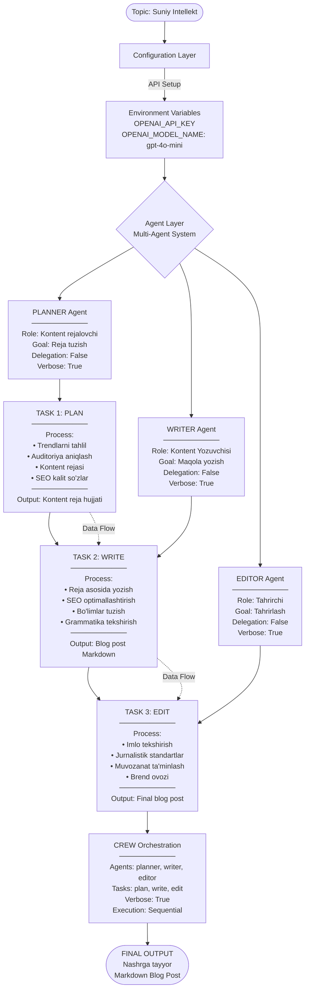

# research-agent

```mermaid
graph TB
    Start([Topic: Suniy Intellekt]) --> Config[Configuration Layer]
    
    Config --> |API Setup| Env[Environment Variables<br/>OPENAI_API_KEY<br/>OPENAI_MODEL_NAME: gpt-4o-mini]
    
    Env --> AgentLayer{Agent Layer<br/>Multi-Agent System}
    
    AgentLayer --> Planner[PLANNER Agent<br/>───────────<br/>Role: Kontent rejalovchi<br/>Goal: Reja tuzish<br/>Delegation: False<br/>Verbose: True]
    
    AgentLayer --> Writer[WRITER Agent<br/>───────────<br/>Role: Kontent Yozuvchisi<br/>Goal: Maqola yozish<br/>Delegation: False<br/>Verbose: True]
    
    AgentLayer --> Editor[EDITOR Agent<br/>───────────<br/>Role: Tahrirchi<br/>Goal: Tahrirlash<br/>Delegation: False<br/>Verbose: True]
    
    Planner --> Task1[TASK 1: PLAN<br/>───────────<br/>Process:<br/>• Trendlarni tahlil<br/>• Auditoriya aniqlash<br/>• Kontent rejasi<br/>• SEO kalit so'zlar<br/>───────────<br/>Output: Kontent reja hujjati]
    
    Task1 --> Task2[TASK 2: WRITE<br/>───────────<br/>Process:<br/>• Reja asosida yozish<br/>• SEO optimallashtirish<br/>• Bo'limlar tuzish<br/>• Grammatika tekshirish<br/>───────────<br/>Output: Blog post Markdown]
    
    Task2 --> Task3[TASK 3: EDIT<br/>───────────<br/>Process:<br/>• Imlo tekshirish<br/>• Jurnalistik standartlar<br/>• Muvozanat ta'minlash<br/>• Brend ovozi<br/>───────────<br/>Output: Final blog post]
    
    Writer --> Task2
    Editor --> Task3
    
    Task1 -.->|Data Flow| Task2
    Task2 -.->|Data Flow| Task3
    
    Task3 --> Crew[CREW Orchestration<br/>───────────<br/>Agents: planner, writer, editor<br/>Tasks: plan, write, edit<br/>Verbose: True<br/>Execution: Sequential]
    
    Crew --> Result([FINAL OUTPUT<br/>Nashrga tayyor<br/>Markdown Blog Post])
```